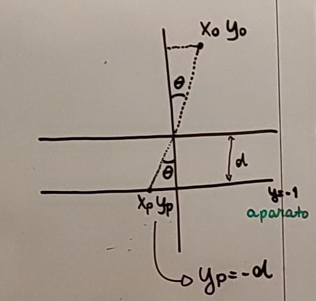
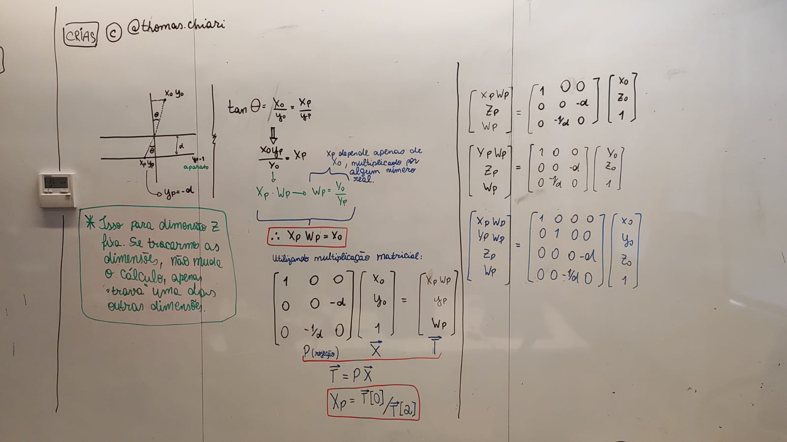

# AlphaCube

### Autores:
- [Marcelo Rabello Barranco](https://github.com/Maraba23)
- [Thomas Chiari Ciocchetti de Souza](https://github.com/thomaschiari)

### Descrição:
O Projeto AlphaCube é um projeto que utiliza a biblioteca `Pygame` para desenhar um cubo rotativo em 3 dimensões. O cubo pode ser rotacionado em torno de seus eixos X, Y e Z.
O programa também permite que o usuário ajuste a distância focal da câmera virtual utilizada para renderizar o cubo de 3 para 2 dimensões através de um controle deslizante.
Se trata de um programa que simula o uso de ferramentas como OpenGL para simular a renderização de objetos 3D em 2D, movendo o cubo em torno de um eixo e alterando a distância focal da câmera virtual.

### Requisitos e Instruções:
1. Certifique-se de ter instalado Python na versão 3.9 ou superior.
2. Clone o repositório do projeto através do comando no terminal: 
`git clone https://github.com/Maraba23/AlphaCube.git`
3. Acesse a pasta do projeto através do comando no terminal:
`cd AlphaCube`
4. (Recomendado) Crie um ambiente virtual para o projeto através do comando no terminal:
`python3 -m venv env`
5. Ative o ambiente virtual através do comando no terminal:
`source env/bin/activate` (Linux)
`env\Scripts\Activate.ps1` (Windows)
6. Instale as dependências do projeto através do comando no terminal:
`pip install -r requirements.txt`
7. Execute o programa através do comando no terminal:
`python3 AlphaCube.py`
8. Para fechar o jogo, basta pressionar a tecla `ESC`, ou simplesmente fechar a janela.
9. Para desativar o ambiente virtual, basta executar o comando no terminal:
`deactivate`

### Teoria:
O projeto usa como base a teoria por trás de uma câmera Pinhole, que consiste em uma câmera com um pequeno orifício e um aparato fotossensível. Quando a luz entra pelo orifício, gera uma imagem invertida no aparato.
Em um plano cartesiano bidimensional, é possível pensar na câmera com o orifício sendo o ponto (0, 0), e o aparato sendo uma reta que fica a uma distância *d* desse orifício. Assim, diversos pontos no plano cartesiano podem ser projetados nessa reta, como mostra a figura a seguir:



Na figura, o aparato é representado pela reta *y = -1*, e a distância focal *d* é representada pela distância entre o ponto (0, 0) e a reta *y = -1*, que é igual a 1.
Assim, é possível projetar o ponto $x_0, y_0$ na reta *y = -1* e obter o ponto $x_p, y_p$, utilizando semelhança de triângulos.
No caso acima, é importante notar que a dimensão *z* é fixa, ou seja, há apenas duas dimensões.
É possível alterar isso fixando uma das demais dimensões, tornando as outras duas variáveis. 

Por semelhança de triângulos, no caso acima, temos que:

$$
tan(\theta) = \frac{x_0}{y_0} = \frac{x_p}{y_p}
$$

Ou seja, 

$$
x_p = \frac{x_0}{y_0}y_p
$$

Para realizar o cálculo matricial, precisamos que o valor projetado, multiplicado por algum número real, dependa apenas de $x_0$. Assim, precisaremos obter um número $w_p$, tal que:

$$
x_p * w_p = x_0
$$

Com $w_p$ assumindo o valor de $\frac{y_0}{y_p}$. Com isso, podemos utilizar uma multiplicação matricial para resolver, com uma matriz de projeção *P*, que realizará a transformação de coordenadas 2D para uma dimensão, multiplicada por um vetor de coordenadas bidimensionais $\overrightarrow{X}$, $[x_0, y_0, 1]^T$, para obter um vetor de coordenadas $\overrightarrow{T}$, $[x_p * w_p, y_p, w_p]^T$.

Como sabemos que $x_p * w_p$ depende apenas de $x_0$, é possível deduzir a primeira linha da matriz *P*: $[1, 0, 0]$, ou seja, após a multiplicação matricial, o valor de $x_p * w_p$ será igual ao valor de $x_0$. 
Também sabemos que o valor de $y_p$ será igual à distância focal *d*, que representa a distância entre o orifício da câmera e o aparato. Assim, a segunda linha da matriz *P* será $[0, 0, -d]$. Após a multiplicação matricial, o valor de $y_p$ será igual a $-d$. A distância precisa ser negativa pois a reta, como pode ser visto na figura acima, está abaixo da origem.

Por fim, precisamos saber o valor $w_p$. Sabemos que $w_p = \frac{y_0}{y_p}$, e que $y_p = -d$. Assim, podemos concluir que $w_p = \frac{y_0}{-d}$. Assim, a terceira linha da matriz *P* será $[0, 0, \frac{y_0}{-d}]$. Portanto, a última linha da matriz *P* será $[0, \frac{1}{-d}, 0]$.

Com isso, podemos concluir que a matriz *P* será:

$$
P = \begin{bmatrix}
1 & 0 & 0 \\
0 & 0 & -d \\
0 & \frac{1}{-d} & 0 \\
\end{bmatrix}
$$

Com isso, após realizarmos a multiplicação matricial, é possível obter as coordenadas no plano cartesiano das imagens projetadas na reta *y = -1*.
O vetor $\overrightarrow{T}$ é obtido a partir da multiplicação $P @ \overrightarrow{X}$, ou seja:

$$
\begin{bmatrix}
x_o \\
y_o \\
1
\end{bmatrix} @ \begin{bmatrix}
1 & 0 & 0 \\
0 & 0 & -d \\
0 & \frac{1}{-d} & 0 \\
\end{bmatrix} = \begin{bmatrix}
x_p * w_p \\
y_p \\
w_p
\end{bmatrix}
$$

Após esse resultado, podemos obter o valor projetado $x_p$ através da divisão $\overrightarrow{T}[0] / \overrightarrow{T}[2]$. Assim obtemos as coordenadas projetadas $x_p, y_p$.

Para realizar a projeção de um objeto tridimensional em um espaço bidimensional, a teoria é a mesma. O que muda é que o orifício pode ser considerado como estando na origem, $(0,0,0)$, e o aparato, em um plano bidimensional que está a uma distância *d* do orifício.
Assim, o vetor $\overrightarrow{X}$, que representa as coordenadas do objeto, será um vetor tridimensional, $[x_0, y_0, z_0, 1]^T$. O vetor $\overrightarrow{T}$, que representa as coordenadas projetadas, será $[x_p * w_p, y_p * w_p, z_p, w_p]^T$. A matriz *P* será:

$$
P = \begin{bmatrix}
1 & 0 & 0 & 0 \\
0 & 1 & 0 & 0 \\
0 & 0 & 0 & -d \\
0 & 0 & \frac{1}{-d} & 0 \\
\end{bmatrix}
$$

Os cálculos anteriores foram feitos com o aparato estando fixo paralelamente ao eixo *y* e com a dimensão *z* fixa, sendo necessário obter o ponto $x_p$. Alterando isso, obtemos os mesmos cálculos para o caso em que o aparato está fixo paralelamente ao eixo *x* e com a dimensão *z* fixa, chegando às mesmas conclusões para obter o ponto $y_p$. O ponto $z_p$ é obtido à partir da distância, como era obtido o ponto $y_p$ anteriormente.

Segue, a seguir, uma imagem que representa um resumo teórico da explicação acima:



No código, a primeira coisa que é feita é definir as coordenadas dos vértices do cubo, armazenados no array `corners`. A função `draw_cube` irá utilizar essas coordenadas e a distância focal (`focal_length`) para desenhar o cubo em um espaço bidimensional, utilizando a teoria acima explicada.
Ademais, a função também realiza as rotações do cubo nos 3 eixos utilizando trigonometria e multiplicações matriciais. Definimos os senos e cossenos dos ângulos que serão incrementados a cada tick do andamento do programa, e depois definimos as matrizes de rotação para cada eixo:

$$ 
R_x = \begin{bmatrix}
1 & 0 & 0 \\
0 & cos(\theta) & -sin(\theta) \\
0 & sin(\theta) & cos(\theta) \\
\end{bmatrix} 
$$

$$ 
R_y = \begin{bmatrix}
cos(\theta) & 0 & sin(\theta) \\
0 & 1 & 0 \\
-sin(\theta) & 0 & cos(\theta) \\
\end{bmatrix} 
$$

$$ 
R_z = \begin{bmatrix}
cos(\theta) & -sin(\theta) & 0 \\
sin(\theta) & cos(\theta) & 0 \\
0 & 0 & 1 \\
\end{bmatrix}
$$

Com isso, podemos aplicar as rotações nos vértices do cubo, utilizando a multiplicação matricial. Isso está aplicado na seguinte seção do código:

```python
    # Matrizes de rotação para cada eixo
    R_X = np.array([
        [1, 0, 0, 0],
        [0, math.cos(angulo_x), -math.sin(angulo_x), 0],
        [0, math.sin(angulo_x), math.cos(angulo_x), 0],
        [0, 0, 0, 1]
    ])

    R_Y = np.array([
        [math.cos(angulo_y), 0, math.sin(angulo_y), 0],
        [0, 1, 0, 0],
        [-math.sin(angulo_y), 0, math.cos(angulo_y), 0],
        [0, 0, 0, 1]
    ])

    R_Z = np.array([
        [math.cos(angulo_z), -math.sin(angulo_z), 0, 0],
        [math.sin(angulo_z), math.cos(angulo_z), 0, 0],
        [0, 0, 1, 0],
        [0, 0, 0, 1]
    ])

    # Matriz de rotação final
    R = R_X @ R_Y @ R_Z
```

Assim, o cubo pode ser rotacionado nos eixos $x$, $y$ e $z$.

Para realizar as rotações, é necessário realizar uma translação no eixo Z, para que o cubo não fique "preso" no orifício. Isso é feito na seguinte seção do código:

```python
    # Matrizes de translação do eixo Z e para o centro da tela
    T_Z = np.array([
        [1, 0, 0, 0],
        [0, 1, 0, 0],
        [0, 0, 1, dist_focal],
        [0, 0, 0, 1]
    ])
```

Por fim, o cubo é transladado novamente para o centro da tela:

```python
    T_CENTRO = np.array([
        [1, 0, 0, tamanho_tela[0] // 2],
        [0, 1, 0, tamanho_tela[1] // 2],
        [0, 0, 1, 0],
        [0, 0, 0, 1]
    ])
```

Por fim, definimos a matriz de projeção do Pinhole, e, por meio de multiplicações matriciais, obtemos a matriz de transformação final que, também por meio de multiplicações matriciais, será aplicado ao cubo:

```python
    # Matriz de projeção Pinhole
    P = np.array([
        [1, 0, 0, 0],
        [0, 1, 0, 0],
        [0, 0, 0, -dist_focal],
        [0, 0, -1/dist_focal, 0]
    ])

    # Matriz de transformação final
    M_T = T_CENTRO @ P @ T_Z @ R

    # Aplicando a transformação no cubo
    C = M_T @ vertices
```

Após isso, realizamos as operações padrão do `Pygame` para desenhar o cubo na tela, utilizando as coordenadas presentes na matriz $C$. 
Para descobrirmos os pontos $x_p, y_p$, como discutido anteriormente, precisamos dividir os resultados obtidos por $w_p$, e isso é feito, no código, diretamente na função `draw_line`, chamada para desenhar cada aresta do cubo:

```python
    pygame.draw.line(tela, (255, 255, 255), (C[0, 0]/C[3, 0], C[1, 0]/C[3, 0]), (C[0, 1]/C[3, 1], C[1, 1]/C[3, 1]))
    pygame.draw.line(tela, (255, 255, 255), (C[0, 1]/C[3, 1], C[1, 1]/C[3, 1]), (C[0, 2]/C[3, 2], C[1, 2]/C[3, 2]))
    pygame.draw.line(tela, (255, 255, 255), (C[0, 2]/C[3, 2], C[1, 2]/C[3, 2]), (C[0, 3]/C[3, 3], C[1, 3]/C[3, 3]))
    pygame.draw.line(tela, (255, 255, 255), (C[0, 3]/C[3, 3], C[1, 3]/C[3, 3]), (C[0, 0]/C[3, 0], C[1, 0]/C[3, 0]))
    pygame.draw.line(tela, (255, 255, 255), (C[0, 4]/C[3, 4], C[1, 4]/C[3, 4]), (C[0, 5]/C[3, 5], C[1, 5]/C[3, 5]))
    pygame.draw.line(tela, (255, 255, 255), (C[0, 5]/C[3, 5], C[1, 5]/C[3, 5]), (C[0, 6]/C[3, 6], C[1, 6]/C[3, 6]))
    pygame.draw.line(tela, (255, 255, 255), (C[0, 6]/C[3, 6], C[1, 6]/C[3, 6]), (C[0, 7]/C[3, 7], C[1, 7]/C[3, 7]))
    pygame.draw.line(tela, (255, 255, 255), (C[0, 7]/C[3, 7], C[1, 7]/C[3, 7]), (C[0, 4]/C[3, 4], C[1, 4]/C[3, 4]))
    pygame.draw.line(tela, (255, 255, 255), (C[0, 0]/C[3, 0], C[1, 0]/C[3, 0]), (C[0, 4]/C[3, 4], C[1, 4]/C[3, 4]))
    pygame.draw.line(tela, (255, 255, 255), (C[0, 1]/C[3, 1], C[1, 1]/C[3, 1]), (C[0, 5]/C[3, 5], C[1, 5]/C[3, 5]))
    pygame.draw.line(tela, (255, 255, 255), (C[0, 2]/C[3, 2], C[1, 2]/C[3, 2]), (C[0, 6]/C[3, 6], C[1, 6]/C[3, 6]))
    pygame.draw.line(tela, (255, 255, 255), (C[0, 3]/C[3, 3], C[1, 3]/C[3, 3]), (C[0, 7]/C[3, 7], C[1, 7]/C[3, 7]))
```

Como pode ser visto, em cada coordenada temos a divisão do valor $x_p * w_p$ e $y_p * w_p$, respectivamente, por $w_p$, presente na terceira linha da matriz.
